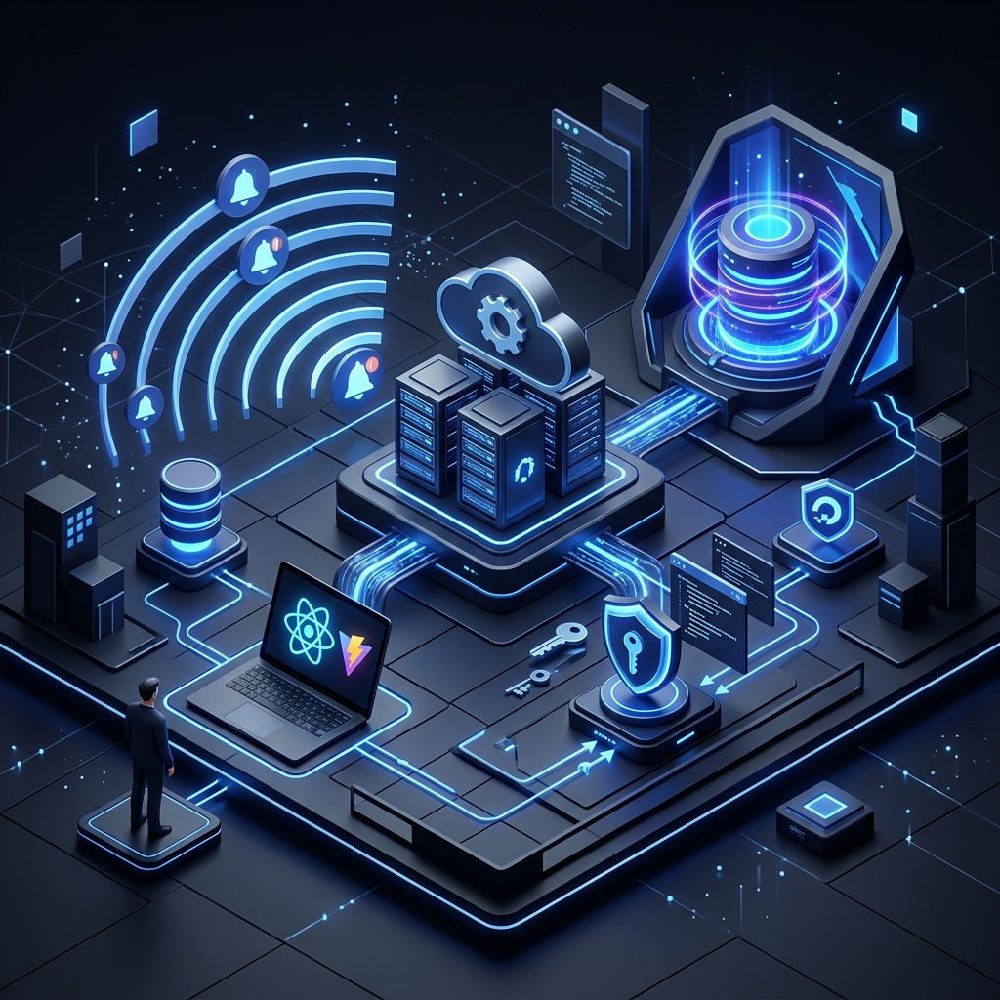

# Biblia Técnica TalenHuman Elite V13.0
**La Referencia Maestra de Ingeniería, Arquitectura y Escalabilidad**  
**Estatus**: Documento de Estado del Arte (State of the Art)

---

## 🔝 1. Visión Técnica y Propuesta de Valor

TalenHuman Elite V13.0 representa la culminación de un diseño orientado a la **Alta Disponibilidad** y la **Escalabilidad Elástica**. No es solo un software de gestión; es una infraestructura de misión crítica diseñada para responder bajo presión, garantizando que el núcleo de negocio de nuestros clientes sea resiliente ante cualquier escala.

---

## 🏛️ 2. Blueprints Estructurales (Vista 360°)

Hemos descompuesto la arquitectura en 4 niveles de abstracción para garantizar una transparencia total ante auditorías técnicas.

### A. Diagrama de Contexto (El Sistema y su Entorno)
Muestra cómo TalenHuman interactúa con los gigantes tecnológicos para ofrecer una experiencia fluida.

### B. Diagrama de Contenedores (La Aplicación)
Disección de los macro-componentes que viven dentro de nuestra orquestación Docker.

### C. Diagrama de Componentes (Radiografía del Código)
Cómo se conectan los controladores con la lógica inteligente y los trabajadores de fondo.

---

## 📦 3. Censo de Componentes Elite (Registro Maestro)

### El Directorio de los 34 Controladores API
| Categoría | Propósito Principal | Controladores Clave |
| :--- | :--- | :--- |
| **Core Admin** | Gestión de Entidades Maestras | `Companies`, `Stores`, `Employees`, `Users`, `Profiles`. |
| **Operaciones** | Ciclo de vida de Asistencia | `Attendance`, `Shifts`, `Jornadas`, `ShiftApproval`, `Novedades`. |
| **Inteligencia IA** | Motor de Predicción | `PredictiveHolidays`, `PredictiveRules`, `PredictiveSync`. |
| **Business BI** | Analítica de Ventas | `Sales`, `SalesChannels`, `SalesTimeBands`. |
| **Sistemas** | Infraestructura y Seguridad | `Security`, `SystemSettings`, `AuditLogs`, `Notifications`. |

### El Modelo de Datos (40+ Entidades)
Nuestro esquema de PostgreSQL está optimizado para relaciones complejas. Las entidades core como `Employee`, `Shift` y `Attendance` cuentan con índices de rendimiento diseñados para millones de registros.

---

## 🧠 4. Los Pilares de Innovación (Deep Dives)

### I. Lógica de Predicción IA (The Math Core)
El Scheduler no solo asigna; predice mediante un motor de **Estacionalidad Dinámica**. A diferencia de sistemas estáticos, la plataforma permite configurar un **Lookback Period (1-8 semanas)** para calcular promedios adaptativos.

- **Algoritmo de Demanda**: 
  `Demanda_Hora = Máx( (Promedio_Histórico / Ratio_Productividad), MinStaff_Regla )`
  *El Promedio_Histórico se calcula sobre el rango de semanas configurado (ej. 3, 4 u 8 semanas), filtrado por tipo de métrica (Ventas, Tickets, Clientes) y canales de venta específicos.*

- **Métricas del Hub de Inteligencia**:
    - **Sugeridos (Gaps)**: Sumatoria de horas faltantes (`Demanda > Programado`) en todos los perfiles durante la semana. Representa la "deuda de staff" operativa.
    - **Eficiencia %**: `(Horas_Programadas_Útiles / Total_Horas_Demandadas) * 100`. Solo considera horas que cubren una necesidad real; el exceso de personal en horas valle no suma a la eficiencia.
    - **Crítico (Hora Pico)**: Identifica el punto exacto del día donde el déficit acumulado de personal es mayor, permitiendo al gerente priorizar refuerzos quirúrgicos.

### II. Infraestructura de Señal "Gota a Gota" (Push/FCM)
Utilizamos **Named App Instances** en Firebase Admin SDK. Esto permite que cada empresa (Tenant) tenga su propio aislamiento de notificaciones, garantizando un tiempo de entrega de <2 segundos para el 99% de los mensajes.

### III. El Perímetro de Seguridad (Cybersecurity)
- **Doppler Injection**: Las llaves nunca tocan el disco duro. Se inyectan directamente en el entorno de ejecución del contenedor Docker.
- **Tenant Handshake**: Cada petición es validada contra un `CompanyId` inmutable en el contexto de la base de datos, eliminando cualquier posibilidad de Cross-Tenant Leakage.

---

## 📈 5. Escalabilidad, Rendimiento y Resiliencia

### Estrategia de Crecimiento Infinito
- **PostgreSQL Managed Clusters**: Escalado vertical y horizontal transparente sin tiempo de inactividad.
- **Npgsql Connection Pooling**: Manejo eficiente de miles de conexiones simultáneas.
- **Dockerization**: Permite el auto-escalado basado en la carga de la CPU mediante orquestadores de nube.

### Recuperación ante Desastres (Disaster Recovery)
- **Backups Diarios**: Automatizados y geo-redundantes en DigitalOcean.
- **Configuración de Redundancia**: Clústeres de base de datos con nodos de lectura (Read Replicas) para distribuir la carga de los reportes BI.

---
*Este documento es el Blueprint de Ingeniería definitivo para TalenHuman Elite V13.0.*
