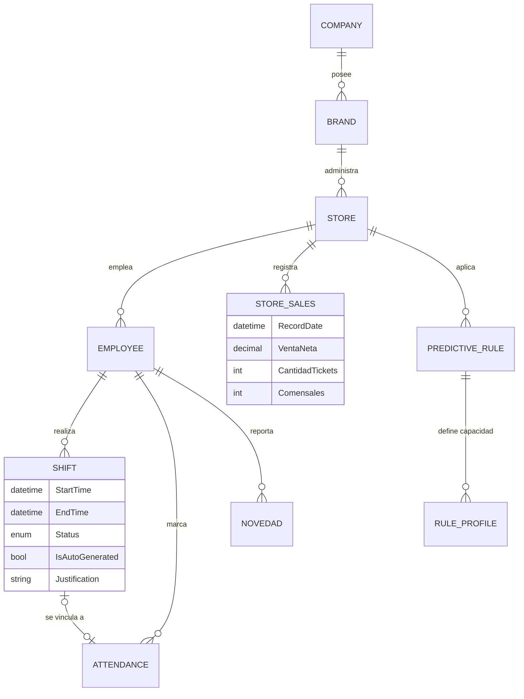

# Especificación: Capa de Datos y Lógica de Predicción IA
**Proyecto**: TalenHuman Elite V13.0  
**Fecha**: Abril 2026

Este documento detalla la estructura de datos que soporta el ecosistema de TalenHuman y el algoritmo matemático utilizado por el motor de inteligencia predictiva para la generación de horarios.

---

## 1. Diagrama Entidad-Relación (MER)

El siguiente diagrama visualiza las relaciones críticas entre la estructura organizacional y la operación diaria de turnos y ventas.

### Descripción de Vínculos Críticos:
- **Tienda (Store) a Ventas (Sales)**: La base del motor IA. Las ventas en intervalos de 30 minutos alimentan la predicción.
- **Turno (Shift) a Marcación (Attendance)**: Permite el análisis de brechas entre lo programado y lo ejecutado en tiempo real.
- **Regla Predictiva (Rule) a Perfiles**: Define cuántos empleados de cada cargo (Chef, Mesero, etc.) se necesitan según el volumen de ventas.

---

## 2. Diccionario de Datos (Campos Clave)

### Tabla: `StoreSales` (Entrada IA)
| Campo | Tipo | Descripción |
| :--- | :--- | :--- |
| `RecordDate` | DateTime | Fecha y hora normalizada (intervalos de 30 min). |
| `VentaNeta` | Decimal | Valor total de ventas en el intervalo. |
| `Tickets` | Integer | Número de transacciones realizadas. |

### Tabla: `Shift` (Operación Elite)
| Campo | Tipo | Descripción |
| :--- | :--- | :--- |
| `IsAutoGenerated`| Boolean | Indica si el turno fue sugerido por la IA. |
| `Justification` | String | Justificación obligatoria para cambios en semanas aprobadas. |
| `ApprovedAt` | DateTime | Timestamps de auditoría V13.0 de aprobación semanal. |

---

## 3. Memoria de Cálculo: Predicción de Horarios

El sistema utiliza un algoritmo de **Promedio Histórico Ponderado con Ajuste de Estacionalidad**.

### Paso 1: Cálculo del Volumen Predictivo
Para un día `D` a la hora `H`, el sistema calcula:
$$V(H) = \frac{V_{w-1}(H) + V_{w-2}(H) + V_{w-3}(H)}{3} \times F_{ajuste}$$

Donde:
- **$V_{w-n}$**: Ventas del mismo día de la semana hace $n$ semanas.
- **$F_{ajuste}$**: Factor aplicado si el día es festivo o especial operativo.

### Paso 2: Conversión a Necesidad de Personal (Staffing)
Una vez obtenido el volumen $V(H)$, se aplica la **Ratio de Capacidad** configurada:
$$\text{Colaboradores Necesarios} = \max\left(\frac{V(H)}{\text{Ratio}}, \text{Carga Mínima}\right)$$

*Ejemplo: Si la Ratio es 1 mesero por cada 20 tickets y la predicción es de 60 tickets, el sistema sugerirá 3 meseros para esa hora.*

---

## 4. Exportación a PDF

Para entregar este documento formalmente:
1. Abra la paleta de comandos de VS Code (`Ctrl+Shift+P`).
2. Ejecute `Markdown PDF: Export (pdf)`.
3. El documento conservará el diagrama de base de datos y las fórmulas matemáticas en un formato profesional listo para gerencia.
