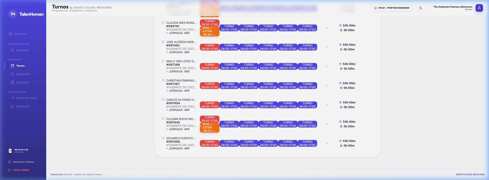
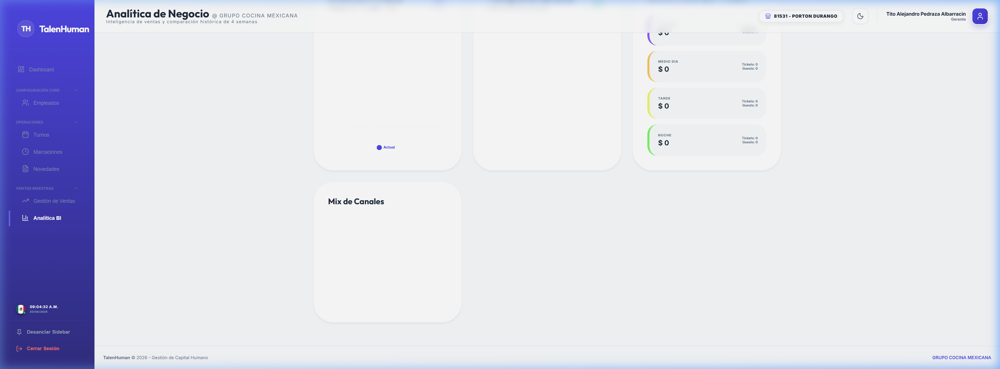
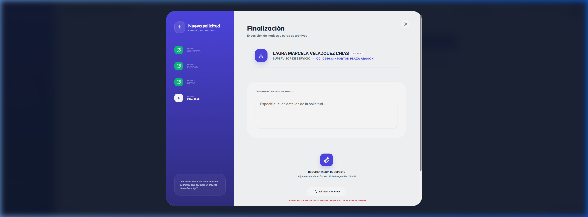

# Manual de Usuario: Gerente de Sede (Elite V13.0)
**Módulo**: Programación de Turnos e Inteligencia IA  
**Rol**: Gerentes / Jefes de Operación

Bienvenido a la guía funcional del "Command Center" de TalenHuman. Este manual le enseñará a optimizar su operación utilizando las herramientas predictivas de última generación.

---

## 1. El Command Center (Programador)
Esta es su herramienta principal. Aquí podrá visualizar a todo su equipo, sus jornadas y cómo se comparan contra la necesidad real de la tienda.

### Elementos Clave:
- **Columnas de 110px**: Diseño optimizado para ver la semana completa sin desorden.
- **Badges de Festivos**: Indicadores rojos o ámbar que le alertan sobre días especiales para que no descuide el staffing.

---

## 2. Análisis de Cobertura IA
Al hacer clic en la fila de **"Previsión IA"**, el sistema abrirá un panel analítico profundo.

### ¿Cómo interpretarlo?
- **Gráfica de Tendencia**: Muestra la venta proyectada vs. los turnos actuales.
- **Zonas de Riesgo (Rojo)**: Indican horas donde le falta personal. El sistema le sugerirá exactamente cuántas personas agregar para cubrir la demanda.

---

## 3. Justificación de Cambios (Semanas Cerradas)
Para mantener la integridad de los datos, las semanas que ya han sido aprobadas por RH tienen un nivel superior de seguridad.

### Regla de Oro:
Si necesita agregar un turno en una semana ya aprobada, el sistema le pedirá obligatoriamente:
1. **Comentario Administrativo**: Explicar por qué es necesario el cambio (ej. "Reemplazo por incapacidad de última hora").
2. **Aprobación de Flujo**: El cambio quedará registrado para auditoría de RH.

---

## 4. Reportes y Exportación
En la esquina superior derecha dispone de las herramientas de exportación:
- **Excel**: Para procesamientos locales.
- **PDF**: Para copias físicas o envío por correo.

---
*Fin del Manual del Gerente*
