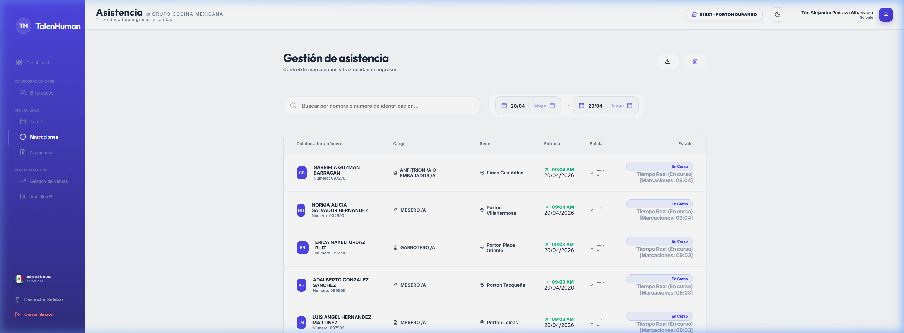

# Manual de Usuario: Recursos Humanos y Auditoría
**Módulo**: Control de Asistencia y Reportabilidad  
**Rol**: Analistas RH / Auditores de Nómina

Este manual proporciona las herramientas necesarias para supervisar el cumplimiento de la jornada laboral y auditar la veracidad de la información registrada en el sistema.

---

## 1. Monitor de Asistencia en Tiempo Real
Desde este módulo, RH puede supervisar quién ha marcado entrada y quién tiene retrasos o faltas injustificadas.

### Indicadores de Auditoría:
- **Verde (Correcto)**: Marcación dentro de la tolerancia de 15 minutos.
- **Amarillo (Desfasado)**: El empleado realizó la marca pero fuera del horario programado.
- **Rojo (Sin Marcación)**: Alerta crítica donde el sistema detectó un turno programado sin registro biométrico.

---

## 2. Gestión de Novedades y Ausentismos
RH es la autoridad final para aprobar novedades que impactan la nómina.

- **Fase de Revisión**: Toda incapacidad o permiso cargado por un gerente requiere la validación de un adjunto legal en el sistema.
- **Impacto en el Programador**: Una vez aprobada la novedad por RH, el programador del gerente mostrará automáticamente la casilla bloqueada para evitar citar al empleado ese día.

---

## 3. Generación de Reportes de Nómina
El sistema consolida semanal y mensualmente las horas reales trabajadas.

### Pasos para Exportar:
1. Filtrar por Sede y rango de fechas.
2. Seleccionar el formato (PDF para archivo formal, Excel para cálculo de nómina).
3. El reporte incluirá:
    - Horas programadas vs. Horas reales.
    - Desglose de recargos nocturnos y dominicales (si aplica).
    - Resumen de justificaciones administrativas.

---

## 4. Auditoría de Justificaciones
Como RH, usted puede ver qué gerentes están modificando turnos en semanas ya cerradas y qué explicaciones están dando. Esto es vital para controlar la "fricción de nómina".

---
*Fin del Manual de RH*
